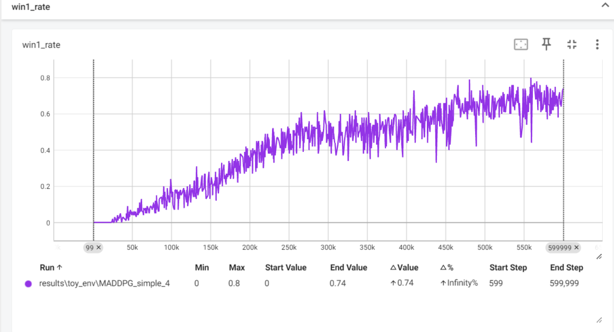

最终使用MADDPG_simple.py和env_restruction.py进行训练，具体训练的调参见MADDPG_simple.py文件  
原因：使用MADDPG_simple.py进行训练，训练速度快， 比MADDPG.py快 因为去掉了一些没用到的trick的if
（效果好，且代码简洁，易于理解）。
MADDPG_raw为原始使用此环境的版本
_duizhao 是为了改成FreeRL一致的版本（MADDPG_simple 和MADDPG ）时使用的临时文件。

具体修改环境见MAPPO.py文件中的 ### 修改环境 注释

在MADDPG_simple.py中的效果如下

然后在MAPPO.py中的效果确不能收敛
在修改的MAPPO_decay_std.py中的效果如下:仍然不能很好收敛。
